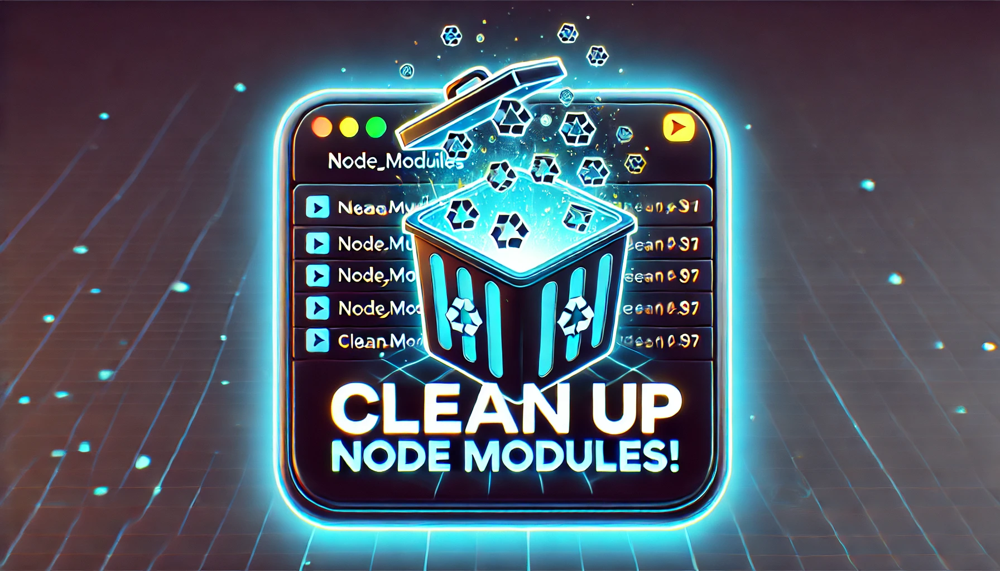

<div align="center" style="margin-bottom: 20px;">

</div>

This script searches for and deletes all `node_modules` directories within a specified directory. It generates a report of the cleanup process, including the amount of storage space reclaimed.

## Prerequisites

- Python 3.x
- `psutil` library

## Setup

1. Clone the repository.
2. Navigate to the project directory.
3. Install the required dependencies:

   ```bash
   pip install -r requirements.txt
   ```

## Usage

Run the script with the following command:

```
python main.py <src-dir>
```

- `<src-dir>`: The directory to start searching for `node_modules` folders.

## Example

```
python main.py /path/to/project
```

This will delete all `node_modules` folders in `/path/to/project` and log the report to `cleanup.log`.

## Output

The script will output a report containing:

- Initial free space
- Total number of `node_modules` folders deleted
- Total directories checked
- Final free space
- Storage reclaimed
- Time taken for the cleanup
- List of deleted `node_modules` folders


The report will be printed to the console and logged to `cleanup.log`.

## Cross-Platform Compatibility

This script is designed to work on Windows, Linux, and macOS. It uses Python's standard libraries and the `psutil` library, which are cross-platform. Here are a few considerations:

- **Path Handling**: The script uses `os.path.join()` to handle file paths, ensuring compatibility across different operating systems.
- **Permissions**: Ensure the script has the necessary permissions to read and delete directories. You may need to run the script with elevated permissions (e.g., as an administrator on Windows or using `sudo` on Unix-like systems).
- **Dependencies**: Make sure `psutil` is installed using `pip install -r requirements.txt`.
- **Python Version**: Ensure Python 3.x is installed on your system.

By following these guidelines, the script should run smoothly on any of these operating systems. 